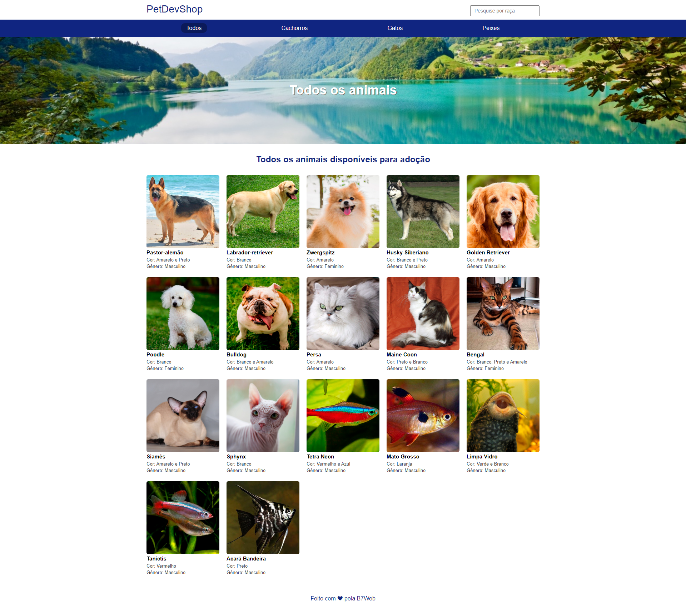

<p align="center">
    
</p>

<p align="center">
  <a href="https://nodejs.org/en/">
    
  </a>

  

  

  

  <a href="https://github.com/luizpedrosm/canil/commits/master">
    
  </a>
	
  <a href="https://www.linkedin.com/in/luizpedrosm">  
    
  </a>  
</p>

<p align="center">
    
</p>

## 💻 Projeto

Canil é um app para adoção de Pets. Projeto feito no módulo do curso "Node + Typescript" da b7web

## 🌐 Web

https://canil.herokuapp.com

## 🧱 Tecnologias

**Cliente:** [HTML](https://www.w3schools.com/html), [CSS](https://www.w3schools.com/css), [Mustache](https://github.com/janl/mustache.js)

**Servidor:** [Node](https://nodejs.org), [Express](https://expressjs.com), [TypeScript](https://www.typescriptlang.org)

**Controle de Versão:** [Git](https://git-scm.com/), [Gitflow](https://www.atlassian.com/br/git/tutorials/comparing-workflows/gitflow-workflow), [Gitmoji](https://gitmoji.dev/)

## ✨ Executar localmente

Clone o projeto

```bash
git clone https://github.com/LuizPedroSM/canil.git
```

Entre na pasta do projeto

```bash
cd canil
```

Instale as dependências globais

```bash
npm install -g nodemon typescript ts-node
```

Instale as dependências

```bash
npm install
```

Inicie o servidor

```bash
npm run start-dev
```

## 🚀 Deploy

```bash
heroku create
git push heroku main
heroku open
```

ou

[](https://heroku.com/deploy?template=https://github.com/LuizPedroSM/canil)

---

Feito com ❤️ por Luiz Pedro: 👋 [Entre em contato](https://www.linkedin.com/in/luizpedrosm/)
